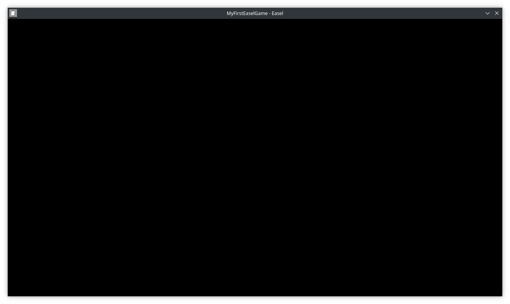
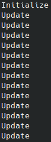
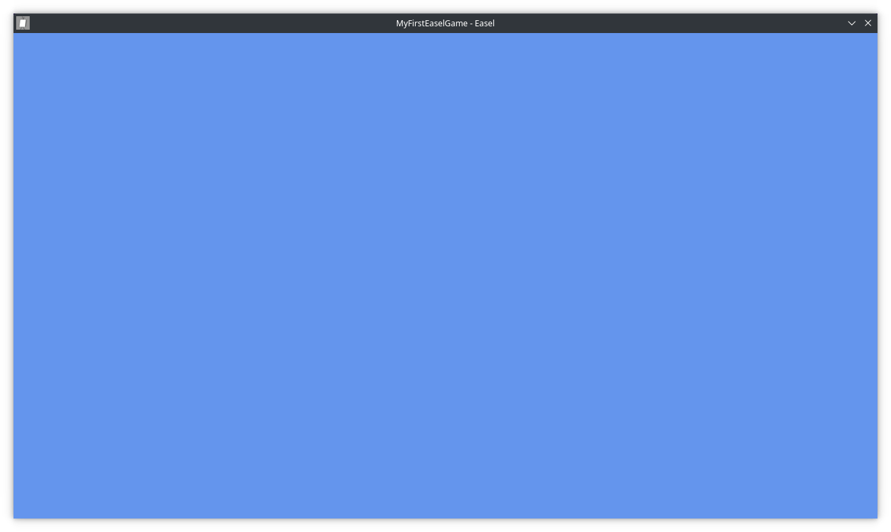
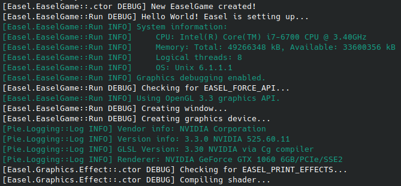

# Getting Started with Easel
> [!Note]
> You can view the full source code for this tutorial [here](https://github.com/piegfx/piegfx-tutorials/tree/main/Easel/Getting-Started/1-Getting-Started).

In this set of tutorials you will learn how to install Easel, and create a basic project with it.

These sets of tutorials will assume you have at least basic knowledge of C# and programming, however will go over the basics of creating a C# project.

## Creating our project
Before we can get started, you'll need a few things installed on your system:
* [.NET 7 SDK or above](https://dotnet.microsoft.com/)
* [git CLI](https://git-scm.com/)

> [!Note]
> For these tutorials, we will be using the git CLI, and the dotnet CLI, as they are universally supported by all platforms.

Let's create our project!

First, create a new folder that you want to put your project in. For this tutorial, we'll be calling it `MyFirstEaselGame`, but you can name it whatever you want.

Once you've done this, you'll want to open your terminal of choice, and `cd` into your newly created project.

Next, run `dotnet new console` to initialize a new console project. Now, run `ls` (`dir` if you're using command prompt) to make sure the project files have been created. You should see a `.csproj` file, as well as a `Program.cs` file.

To make sure it's all working, run `dotnet run`. If you see `Hello, World!` in your terminal, you've created a project!

## Installing
Let's install Easel into our project!

The simplest way is to clone Easel into a parent directory.

`cd` into the parent directory of your project's directory, and run `git clone --recurse-submodules https://github.com/piegfx/Easel` to clone it.

Then, `cd` into the newly created Easel directory, and run `dotnet build`, to ensure everything is built and up-to-date.

Next, `cd` back into your project's directory and run `dotnet add reference ../Easel/Easel/Easel.csproj`. This adds a reference to Easel's project file (which is buried in directories also called "Easel") which we'll need to be able to use it.

Now, just run `dotnet run` again to make sure your program is still working. You should see a few warnings, but as long as you still see `Hello, World!` then that means Easel has been successfully included into your project!

## Our first window
The first thing we need to do before we can progress with Easel is create a window. Fortunately, this is very simple.

First, clear out everything from your `Program.cs` file, then add the following using directive:

```cs
using Easel;
```

### The game settings
Every Easel game must start with some settings, so the game knows how to behave on startup. This is done with the [GameSettings](xref:Easel.GameSettings) struct. This struct contains various startup parameters, including window size, title, icon, etc. For the purposes of this tutorial, the default settings will work well enough.

Add the following to your `Program.cs` file:

```cs
GameSettings settings = new GameSettings();
```

This initializes our settings with the default settings, which, as mentioned above, is good enough for our use case.

### Initializing & running the game
We're almost ready to create our window. Yep, it was that simple! The last thing we need to do is to initialize & run our game.

Every Easel game contains one instance of the [EaselGame](xref:Easel.EaselGame) class. You can have one, and one only, no more, and no less. This is the base class that runs the entire engine, and it's arguably *the* most important class we need to interact with.

Add the following to your `Program.cs` file:

```cs
using EaselGame game = new EaselGame(settings, null);
```

Firstly, [EaselGame](xref:Easel.EaselGame) implements [IDisposable](xref:System.IDisposable), so we must put it in a `using` statement, so that the `Dispose` method gets called automatically on game close.

We then pass in our settings, and for now, a `null` parameter at the end. We'll be changing this later, so don't worry about it for now.

Lastly, add the following to your `Program.cs` file:

```cs
game.Run();
```

This tells our game to start running everything.

Now, run your project and you should see a lovely... blank... window!



If you didn't see a window, compare your code with the result:

```cs
using Easel;

GameSettings settings = new GameSettings();

using EaselGame game = new EaselGame(settings, null);
game.Run();
```

Congrats! You've gotten started in Easel. But, you've only scratched the surface of what Easel can do. And let's be honest... a blank window is not very interesting. In the next section, we'll be creating a **scene**, where we can actually display some stuff!

## Creating a scene
A **scene** is a collection of things that occur when the scene is active, such as displaying entities, and handling logic. Different scenes can have different entities and logic to other scenes. You can only have one `EaselGame` per application, but you can have multiple scenes per application.

Scenes are incredibly useful for game development. For example, you can have a main menu scene, and a main game scene. The main menu scene contains all the logic and entities for the main menu, while the main game scene contains all the logic and entities for your game.

While a scene is not *strictly* required for Easel to function, you will be using at least one in most applications.

### The Scene class
To create a scene, you must inherit from the [Scene](xref:Easel.Scenes.Scene) class. Unlike `EaselGame`, this class cannot operate on its own, and you must inherit from it.

Let's create our scene!

Create a new file called `MyScene.cs`, and give it the following structure:

```cs
using Easel;
using Easel.Scenes;

namespace MyFirstEaselGame;

public class MyScene : Scene
{
    
}
```

You may notice that we are inheriting off the [Scene](xref:Easel.Scenes.Scene) class here. This is key. If you don't, you won't be able to use it as a scene!

Now, let's go back to the `Program.cs` file. Remember that `null` we entered earlier? This is our scene parameter. For the purposes of the earlier tutorial, we did not use a scene, so we must replace this `null` with our scene.

First, add the following using directive to the top of your file:

```cs
using MyFirstEaselGame;
```

Now, just simply replace the `null` parameter with `new MyScene()`.

Run the game again, and you should see the same blank window. While it doesn't look like anything has changed, Easel is now running our scene's logic! The only problem is that we haven't given it any logic to execute. Let's change that!

### Overriding the scene's methods
[Scene](xref:Easel.Scenes.Scene) contains four overridable methods:

* Initialize
* Update
* Draw
* Dispose

For most applications, you'll only ever need to use `Initialize` and occasionally `Update`, however the others are available for those who need them.

For this tutorial, we'll be using the `Initialize` and `Update` methods.

Add the following to your `MyScene` class:

```cs
protected override void Initialize()
{
    base.Initialize();
}

protected override void Update()
{
    base.Update();
}
```

> [!Warning]
> You **must** remember to call `base.Xyz()` in each method. If you don't, entity logic (which we'll get into in a later tutorial) won't work properly. Don't worry about where this call is located right now, as it doesn't matter for these tutorials.

If you add some logs to these methods, you should see something like this:



The `Initialize` method is called **once**, when the scene is first loaded. This is where you will want to create entities and load content.

The `Update` method is called once **per frame**, and is where you will want to put logic that runs every frame.

Let's put some logic in these methods! In the `Initialize` method, we'll change the **clear color**, and in the `Update` method we'll close the window when the escape key is pressed.

### Setting the clear color
Every frame, the window is cleared to a color, before objects are drawn. This defaults to black, however you can change it.

First, add the following using directives to the top of your file:

```cs
using Easel.Entities;
using Easel.Math;
```

Now, add the following to your `Initialize` method:

```cs
Camera.Main.ClearColor = Color.CornflowerBlue;
```

Don't worry too much about the `Camera` entity, as we'll get more into this later, however Easel has a **main camera** in every scene. `Camera.Main` is a quick and easy way to get this camera. Every camera has its own clear color, which we set to a nice sky blue color.

Run your game again and you should see that the window color has changed!



Now, let's add a little bit of logic to the `Update` method.

### Closing the window
Right now, we can close our game by pressing the close button. But that's boring, so let's add some code that can close the window by pressing the escape key!

First, add the following using directive to the top of your file:

```cs
using Pie.Windowing;
```

**Pie** is the underlying graphics system Easel runs on. Pie not only provides Easel's rendering, but it also provides the windowing system that Easel uses. For our usecase here, `Pie.Windowing` provides the `Key` enum that we will use in a second.

> [!Note]
> Outside of a few usecases, such as input, you will never need to interact with Pie directly. However, for advanced users, that option is available if you wish to create your own custom rendering systems within Easel.

In your `Update` method, add the following:

```cs
if (Input.KeyPressed(Key.Escape))
    Game.Close();
```

The [Input](xref:Easel.Input) class provides some helpers to easily query user input, for example, if a key is pressed, or where the mouse pointer is on screen.

We'll be getting into input in a later tutorial, so don't worry about it too much for now.

Finally, run your game again, and try pressing the escape key. Your game should gracefully close. If it does, awesome! You've implemented some logic in your scene.

While this type of logic is extremely basic, you should now be able to see the power of scenes in games.

## Logging
Easel includes a built in logger which you can use to view what it is doing. Logging is extremely useful to locate and track bugs and crashes, so it's recommended that you enable it, especially during development.

Enabling the logger is extremely simple. In your `Program.cs` file, add the following **after** the using directives, but **before** any of the code:

```cs
Logger.UseConsoleLogs();
```

Make sure this is before any code, as Easel starts logging as soon as you do anything with it, including creating and running the `EaselGame`.

Now, run your application again, and you should see various messages in your terminal, like this:



While there won't be a lot right now, as your application expands you'll see more logs fill the terminal. You should also put logs in your application, as this will help you to debug exactly what is happening.

## Wrapping up
You've written your first Easel application! Here's some stuff you can do now:

* Move onto the [next tutorial](), where you'll create some entities and move them around.
* Join the [piegfx discord server](https://discord.gg/ygUpYkUstz) to ask questions and chat with the community.
* [View the full source code](https://github.com/piegfx/piegfx-tutorials/tree/main/Easel/Getting-Started/1-Getting-Started) for this tutorial.

Something not working? [View the final source code](https://github.com/piegfx/piegfx-tutorials/tree/main/Easel/Getting-Started/1-Getting-Started).
